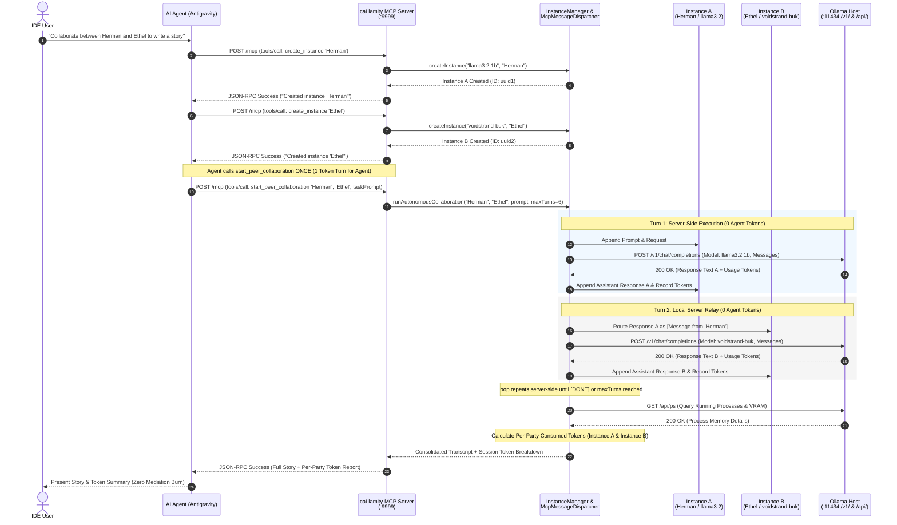

# caLlamity — System Architecture & Design

`caLlamity` is a lightweight, high-throughput Model Context Protocol (MCP) server built with **Java 25** and **Micronaut 5**. It provides an autonomous factory layer for spawning, orchestrating, and tracking multiple Ollama LLM instances using OpenAI-compatible REST APIs.

---

## Architectural Overview

```
 ┌─────────────────────────────────────────────────────────────┐
 │                         IDE / User                          │
 └──────────────────────────────┬──────────────────────────────┘
                                │ Prompt / Workflow Commands
                                ▼
 ┌─────────────────────────────────────────────────────────────┐
 │                    AI Agent (Antigravity)                   │
 └──────────────────────────────┬──────────────────────────────┘
                                │ Streamable HTTP / SSE (JSON-RPC 2.0)
                                ▼
 ┌─────────────────────────────────────────────────────────────┐
 │                 caLlamity MCP Server (:9999)                │
 │  ┌───────────────────────────────────────────────────────┐  │
 │  │ McpController (Netty Event Loops)                     │  │
 │  └───────────────────────────┬───────────────────────────┘  │
 │                              ▼                              │
 │  ┌───────────────────────────────────────────────────────┐  │
 │  │ McpMessageDispatcher (JSON-RPC 2.0 Dispatcher)        │  │
 │  └───────────────────────────┬───────────────────────────┘  │
 │                              ▼                              │
 │  ┌───────────────────────┬───────────────────────────────┐  │
 │  │ InstanceManager       │ MetricsService                │  │
 │  │ (Peer Backchannel)    │ (VRAM / Token Aggregator)     │  │
 │  └───────────┬───────────┴───────────────┬───────────────┘  │
 │              │                           │                  │
 │              ▼                           ▼                  │
 │  ┌───────────────────────────────────────────────────────┐  │
 │  │ OllamaOpenAiClient (Reactive Mono Netty HttpClient)   │  │
 │  └───────────────────────────┬───────────────────────────┘  │
 └──────────────────────────────┼──────────────────────────────┘
                                │ REST API Requests
                                ▼
 ┌─────────────────────────────────────────────────────────────┐
 │                 Ollama Host Server (:11434)                 │
 │   • /v1/chat/completions (OpenAI Chat Format)               │
 │   • /v1/models            (OpenAI Model List)               │
 │   • /api/ps               (Native Process & VRAM Metrics)   │
 └─────────────────────────────────────────────────────────────┘
```

---

## Key Design Principles

1. **100% Reactive & Non-Blocking**:
   - Built on Netty I/O event loops without blocking threads.
   - `OllamaOpenAiClient` uses Project Reactor `Mono<T>` for async HTTP communication.
   - Long-running LLM completions do not hold open worker threads or block Netty loops.

2. **Streamable HTTP & SSE Transport**:
   - Supports both stateless HTTP POST (`/mcp`, `/api/mcp`) and Server-Sent Events (`/mcp/sse`, `/api/mcp/sse`).

3. **Autonomous Peer-to-Peer Backchannel**:
   - `start_peer_collaboration` allows two or more instances to exchange multi-turn dialog server-side without invoking the client AI agent on every turn.
   - **Zero client token cost** during intermediate collaboration turns.
   - Per-party token tracking captures prompt, completion, and total tokens for each participant.

4. **Independent Conversational Isolation**:
   - Each spawned instance maintains its own thread-safe `LlmInstance` state, `List<ChatMessage>` history, task context, and generation parameters (`temperature`, `maxTokens`, `topP`).

---

## Sequence Diagram: Autonomous Collaboration & Tool Dispatch

The following sequence diagram describes the end-to-end interaction flow between the **IDE**, **AI Agent (Antigravity)**, **caLlamity MCP Server**, **Model Instances**, and the **Ollama REST API Host**:



---

## Domain Model Summary

- **`LlmInstance`**: Represents a live spawned model instance holding alias, model name, status, temperature, max tokens, top-P, message list, and token counters.
- **`ChatMessage`**: Immutable record representing OpenAI-formatted chat turns (`role`: system/user/assistant, `content`).
- **`InstanceStatus`**: Enum representing `IDLE`, `PROCESSING`, `ERROR`, `TERMINATED`.
- **`OllamaOpenAiClient`**: Micronaut HTTP client interfacing with Ollama's OpenAI endpoints.
- **`MetricsService`**: Aggregates instance state with live process memory from `/api/ps`.

---

## Author, License & Contact

- **Author**: [voidstrand](https://github.com/voidstrand)
- **License**: Entirely permissive under the [MIT License](LICENSE).
- **Contact**: Questions regarding the project should be sent to `voidstrand@voidstrand.com`.


